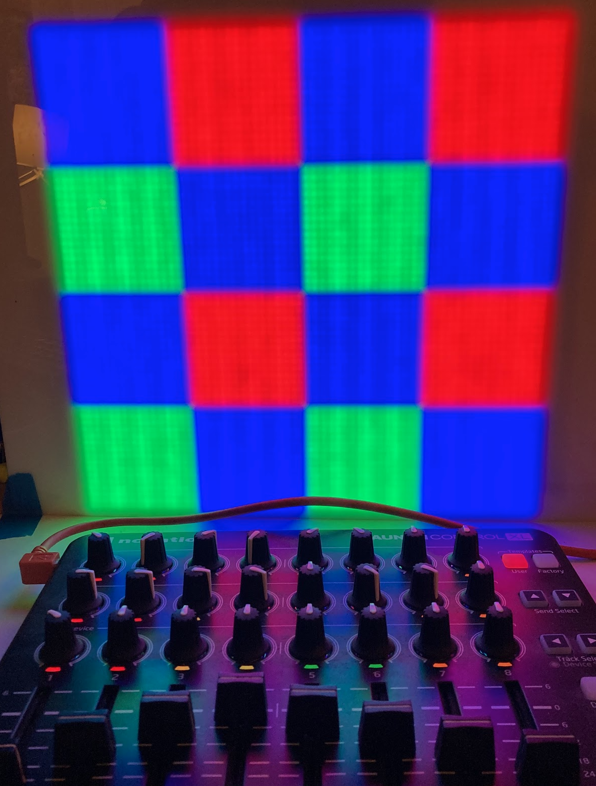
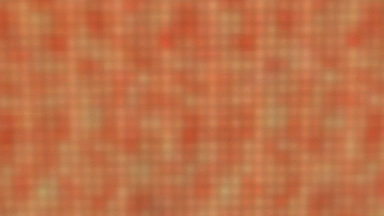

## Beaglebone Black PRU driving a HUB75 LED matrix using DMA

The example in this directory was copied from an [ongoing
project](https://github.com/jmacd/nerve).

[Some friends](https://www.lookingup.art/) had a done a Burning Man
project based on [FadeCandy](https://github.com/scanlime/fadecandy) a
few years ago.  The boards were already discontinued by then, but I
remember thinking how much more colorful the FadeCandy was than
whatever I was getting from the Advatek controllers and ws28xx LED
strips.  (And could we please biuld small LED sculptures, [instead of
large ones](https://www.lookingup.art/rainbow-bridge)?)

Then my friend tells me about the BeagleBone black and how I could
probably use the BBB PRU to do temporal dithering.  So, can I?  Here
we are.

This software uses a MIDI controller to input several variables that
control the R, G, and B values of the display as well as select among
three dithering modes.

### Requirements

- Tested using the AM3358 Debian 10.3 2020-04-06 release, kernel 4.19
- Uses an Octoscroller cape (or equivalent)
- Uses two HUB75 32x64 panels on J1 and J3
- Texas Instruments am335x SDK (for PRU C compiler)
- Golang 1.19 (for control rprogram)
- Novation Launch Control XL
- Midi library (github.com/thestk/rtmidi)
- Alsa library

### Resource table

The PRU program configures a resource table containing:

1. Carveout #1: the framebuffer (8MiB)
2. Carveout #2: the control struct (tiny)
3. RemoteProc Message vdev and vrings
4. Interrupt controller setup for six system events.

### Organization of the frame buffer

I wanted to experiment with temporal dithering, so I organized the
frame layout to optimize write speed.  Each "DoublePixel" in the
framebuffer consts of four preformatted GPIO words (16 bytes); the PRU
writes 64 of these (1024 bytes) to update two rows (128 pixels).

The program reserves 8KiB in the shared-PRU memory region for
intermediate storage.  Half of this space (4 rows) is used for writing
while every 4 rows another DMA transfer starts.  Updating all pixels
in the frame requires 4 DMA transfers (16KiB).  The framebuffer (8MiB)
contains 512 frames, divided into two banks of 256 frames. (Presently
there is no double buffering, so effectively 512 frames.)

One of the nice properties of this layout is that the PRU runs at the
same speed regardless of how many HUB75 boards are in use.  It's
writing all 8 boards in this design whether connected or not.

### Golang control program

Danger!  The Golang control program requires root privileges.  It
will:

1. Open the RPMsg device
2. Read the control struct address
3. Mmap /dev/memory, get a pointer to the control struct
4. Mmap and get a ponter to the framebuffer
5. Fill the framebuffer w/ a solid pink color
6. Begin waiting for MIDI updates (change color value, change dither mode, etc.)
7. Redraw the buffer.

### Results

The PRU is able to update around 2100 frames per second.  Say yes to
dithering in software, FadeCandy.

This has a couple of undiagnosed ways of crashing the Linux host.
It's really good at `omap_intc_handle_irq: spurious irq!`, which
crashes the PRU program.

It needs to use a continuous DMA loop and chaining for smaller
transfer sizes, which may help with the crashes.  It also is spending
too long in dma_wait which makes every 4th row a little brighter than
the other 3.

### Next step

For this to a practical way of rendering actual graphics, the
mechanism to render into this framebuffer needs to be a lot faster.
